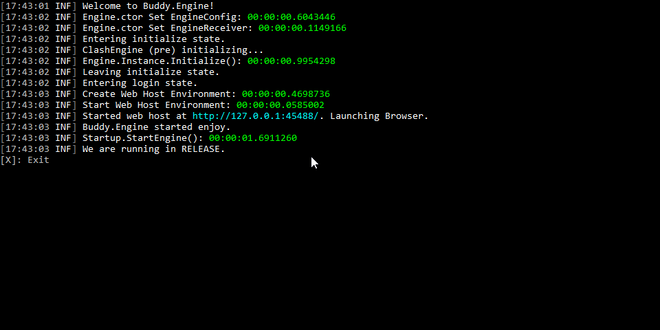
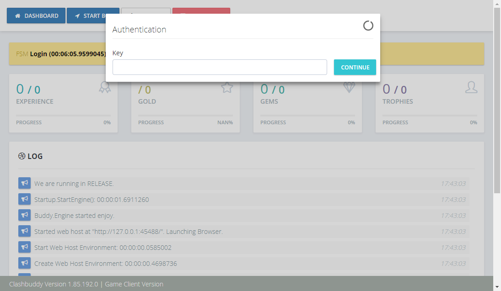
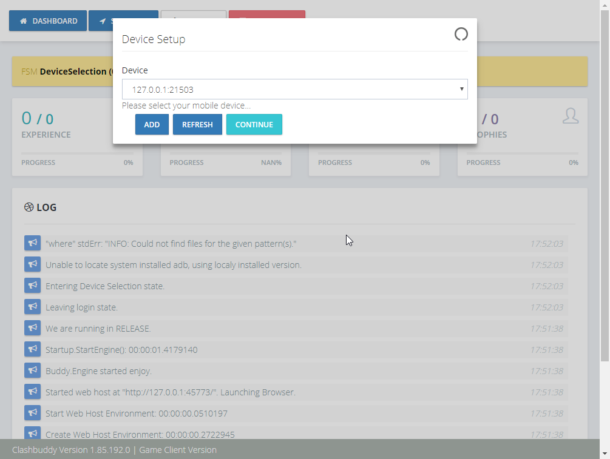
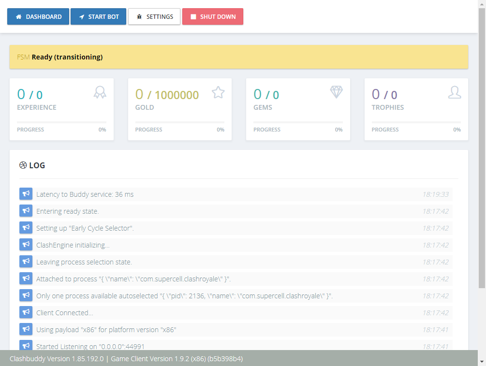
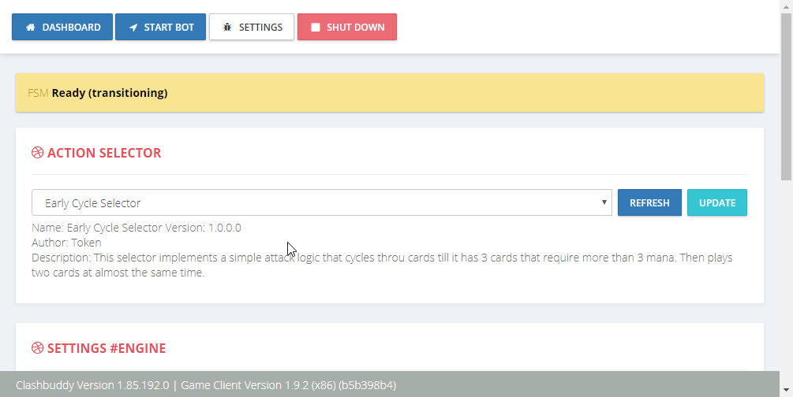

# Getting Started with ClashBuddy

Getting started using ClashBuddy is very straight forward. There are some things you need to know about how the bot works to understand the requirements and considerations to keep in mind while using the bot.

## How is ClashBuddy working

ClashBuddy makes use of the RainbowMagic technology. RainbowMagic is a powerful remote memory manipulation library that allows to read, write and even execute code in a remote process.
The RainbowMagic components used in ClashBuddy require your Android device to be setup in a special way. Please make sure your setup complies with this requirements.

### Host Requirements

The host is the Computer that is running ClashBuddy. The host is responsible for deployment of the payload to the connected device and to run the whole AI of the automation.
Since ClashBuddy is using .Net Core you're able to run the host on different platforms.
Currently supported platforms are Windows7+ x86 and x64 and OSX 10.10+. Please grab the installation package according to your host system.
During startup RainbowMagic trys to detect if you have ADB installed systemwide. When RainbowMagic isn't able to detect installed ADB it downloads the latest version and extracts it in the current executing directory.
When you want to run multiple instance of ClashBuddy on the same host it might make sense to install ADB system wide.

### Device Requirements

ClashBuddy requires an Android device. This device is called Client in RainbowMagic. The client is deployed to the device during the device setup phase. Communication with the device is done using ADB, this means you must activate USB Debugging on your device.
After the client is deployed and activated on the device it trys to connect to the host on the specified ip address. Due to limitations with Android < 5.0 it is required to have a tcp connection between the host and the client.
When your device is using Android greater or equal to 5.0 you don't need to have your device on the same network as your host. In that case the ADB port forwarding features are used.
Due to the things ClashBuddy is able to do on the Device it requires root privileges. Besides the root privileges make sure to that ptrace is enabled in your kernel.

#### Network Requirements

ClashBuddy tries to detect the internal network address of your host. The Settings Tab allows you to specify the IP to listen on.

## Simple Setup

### Device Setup

You need an android device that allows you to run the game. The easiest way to get a device is an emulator. Follow one of our guides to get started.

* [MEmu](./MEmu.md)
* [Bluestacks 3](./Bulestacks%203.md)
* [Lenovo Moto G5/G5 Plus](./Lenovo%20Moto%20G5%20Plus.md)

Once your device is ready you have multiple options to install the target game. Either you get the [APK from a mirror](http://www.apkmirror.com/apk/supercell/clash-royale-supercell/) or you install the game from the [Google Play Store](https://play.google.com/store/apps/details?id=com.supercell.clashroyale). Once the game is installed you're ready to run the bot.

### Bot Setup

Go to the [ClashBuddy Home](http://www.clashbuddy.io/) and download the latest version of the bot. It will come in a zip file. To use the bot extract the files to a folder for example C:\BOTS\ClashBuddy. Inside this folder you will find a Buddy.Launcher executeable. This is the main assembly of the bot. Start the launcher and you will see a console window open.

The Launcher will open a browser window with that contains the ui of the bot.
First thing you will have to do is authenticating with your key. If you don't have a key go to the [ClashBuddy Shop](http://www.clashbuddy.io/) and order one there.

The next screen is the Device Setup screen.

When you click on the Add button you will be able to enter host and port of a not shown device. Select your device and click continue.
When only one device is connected this step is skipped and the bot will connect to the device and start the game when required.

Before starting the Bot you need to setup an action selector. This handles what action to cast where. You can find the action selector selection in the settings area.

During the tutorial use the Sequence Action selector up to the point where you enter your new name. From then it depends on your deck. What action selecor you want to use. The Early Cycle Selector is working okisch for a deck similar to this.

* Knight
* Archer
* Bomber
* Baby Dragon
* Mini P.E.K.K.A
* Giant
* Musketeer
* Skeleton Army